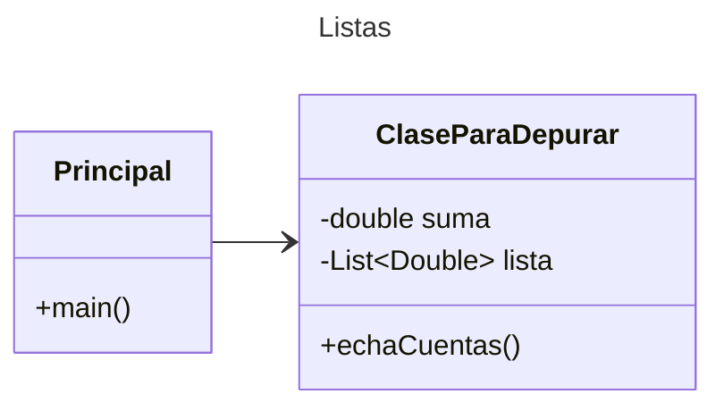

# Proyecto Java - Listas con Maven

Este proyecto implementa estructuras de datos tipo lista en Java, diseñado para las prácticas de la asignatura Mantenimiento de Software.

## Versión de Java

Verifica que tengas la versión adecuada de Java para trabajar con Maven. En caso de requerir una versión especial, usa los siguientes comandos.

### Verificar versión actual
```
java --version
```
### Verificar versiones disponibles para instalar
```
sdk list java
```
### Instalar la última versión
```
sdk install java
```
### Instalar una versión específica
```
sdk install java xxx-version
```
Ejemplo:
```
sdk install java 17.0.18-ms
```

## Diagrama de Clases

Puedes editar el diagrama a continuación usando el [Editor en línea de Mermaid](https://mermaid.live/).



[Documentación de Mermaid para Diagramas de Clases](https://mermaid.js.org/syntax/classDiagram.html)

### Diagrama de Clases UML con draw.io

El repositorio está configurado para crear diagramas de clases UML con **draw.io**. Para usarlo:

1. Agrega un archivo con extensión `.drawio.png`
2. Haz doble clic sobre el archivo
3. Se activará el editor **draw.io** integrado en **VSCode**
4. Asegúrate de agregar las formas UML desde el menú de formas en el lado izquierdo (opción **+Más formas**)

## Generar Diagramas UML con AppMap

Se recomienda utilizar AppMap con Codespaces o VSCode local. Si la extensión no se carga automáticamente, agrégala manualmente desde el marketplace de extensiones de VSCode.

### En GitHub Codespaces

Ejecuta el siguiente comando para generar los archivos AppMap:

```bash
mvn com.appland:appmap-maven-plugin:prepare-agent test
```

Luego, haz clic en el archivo `tmp/appmap/junit/miPrincipal_AppTest_testingList.appmap.json` para visualizar el diagrama de secuencia.

### En VS Code Local

1. Ejecuta las pruebas locales desde VS Code
2. Haz clic en el archivo `tmp/appmap/junit/miPrincipal_AppTest_testingList.appmap.json`
3. Se mostrará el diagrama de secuencia

## Generar Diagramas UML usando Navie Chat (IA de AppMap)

### Prompts para Generar Diagramas

Usa estos prompts en Navie Chat para generar diagramas de clases y secuencia. Una vez generado, puedes visualizar el diagrama en [Mermaid Live](https://mermaid.live/) y copiar el código para documentarlo en este archivo README.md:

Diagrama de clases:
```
@diagram Genera un Diagrama de clases para el paquete `miPrincipal`
```

Diagrama de secuencia:
```
@diagram Genera un Diagrama de secuencia para el paquete `miPrincipal`
```

### Explicar el Proyecto con Navie Chat

Usa estos prompts para obtener explicaciones detalladas del proyecto:

Opción 1:
```
@explain la programación de este proyecto
```

Opción 2:
```
Explica la programación de este proyecto
```

## Uso del Proyecto con Maven

### Compilar el Proyecto

```bash
mvn compile
```

### Ejecutar Pruebas

Ejecutar todas las pruebas:

```bash
mvn test
```

Ejecutar una prueba específica:

```bash
mvn test -Dtest="AppTest#testingList" 
```

### Ejecutar la Aplicación

Usando Maven:

```bash
mvn -q exec:java
```

O usando Java directamente:

```bash
java -cp target/classes miPrincipal.App
```

### Empaquetar la Aplicación

```bash
mvn package
```

### Limpiar Archivos Compilados

```bash
mvn clean
```

## Comandos Git - Gestión de Cambios y Autograding

### Registrar Cambios Importantes

Por cada cambio significativo, actualiza tu historial de versiones:

```bash
git add .
git commit -m "Descripción del cambio"
```

### Enviar Cambios a GitHub para Autograding

Envía tus actualizaciones al repositorio remoto:

```bash
git push origin main
```

> **Nota:** Estos comandos de Git y Maven están diseñados para un ambiente Linux. Para más información sobre ejecución de Maven y JUnit, consulta la [Referencia de JUnit desde línea de comandos](https://www.baeldung.com/junit-run-from-command-line).
